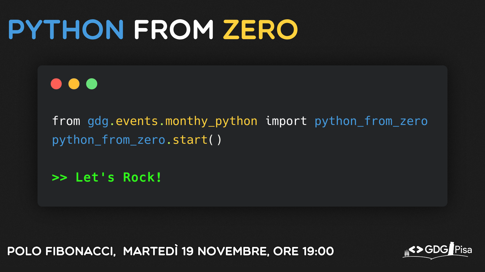

# Python from Zero

Materiale utilizzato durante il talk **Python from Zero**, organizzato dal [GDG Pisa](https://gdgpisa.it) presso l'Università di Pisa.

## Slides
Le slides utilizzate durante il talk sono disponibili per la visualizzazione [qui](https://docs.google.com/presentation/d/1ua2HRiN2450KbYuqhRIHaEO3E_w98NYrRVNezIwY0Xw/edit?usp=sharing). Nelle note di ogni slide sono disponibili i concetti importanti visti insieme.

## Snippets
Tutti gli snippets analizzati durante il talk sono disponibili nella cartella `snippets`, salvati in tanti piccoli file .py e pronti per essere eseguiti (alcuni sono stati modificati in modo da stampare a video le informazioni necessarie). E' presente un ulteriore README con le istruzioni.

## Bot
Come per gli snippets, anche il codice del bot e tutte le istruzioni necessarie per eseguirlo si trovano nella cartella `bot`.

## Credits
Tutti i credits necessari e dovuti si trovano nella penultima slide.

## Come tenere un talk
Se il mio modo di spiegare durante questo talk vi è piaciuto, consiglio vivamente di partecipare al talk “Come tenere un talk” tenuto da Diana Bernabei, molto utile per migliorare le proprie abilità di public speaking. A breve verrà riproposto su Pisa (e non solo), rimanete aggiornati seguendo i canali del [GDG Pisa](https://gdgpisa.it).